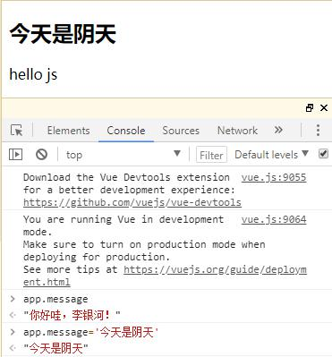
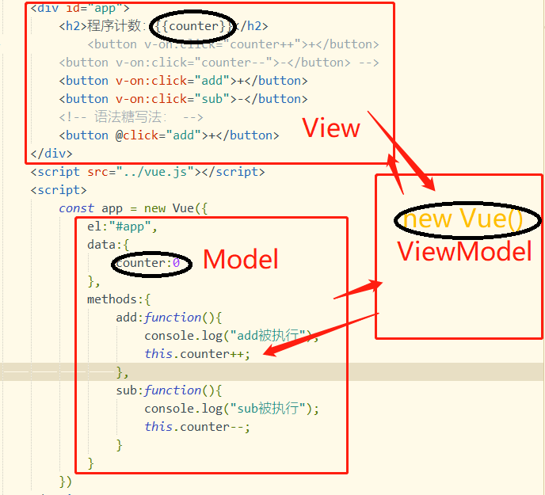

## 一、入门的重点
### 1. Vue的开发特点
#### 1.1 声明式编程
 

> Q：什么是声明式编程？
>
> A：声明式编程（英语：Declarative programming）是一种编程范式，与命令式编程相对立。
>   
> About：
> 
> 命令式编程与声明式编程的简单定义如下：
> 
> * 命令式编程（Imperative programming）：详细地命令机器怎么（How）去处理一件事情以达到我们想要的结果（What）；
> * 声明式编程（Declarative programming）：只告知机器我们想要的结果（What），具体过程由机器想办法完成；
> 
>  
> 通常情况下我们常用的大部分编程语言：c，java，c++等都是命令式编程语言。而像正则表达式（regular expressions）或者逻辑语言（Prolog）则为声明式语言。
>   
> Summary：
> 
> * 命令式编程更加精细化与严谨，程序也会严格地执行我们的命令；
> * 声明式编程能在特定的更高层面代码领域是给我们带来效率的提升，程序员只需要对想要的结果（What）进行深思熟虑，程序会自动的解决过程（How），当然代码看起来也更简洁。
> 

 
声明式编程示例：创建一个vue实例并添加选项
  

	

		<h2>{{message}}</h2>
	

	
	
	

完成以上操作的传统js代码就是命令式编程：

    // 传统js做法（编程范式：命令式编程）
    // 1. 创建div元素，设置id属性
    // 2. 定义一个变量叫message
    // 3. 将message变量放在前面的div元素中显示

* 在创建Vue实例时，会传入一个对象options，这个options可以包含许多选项

	详细解析：[Vue选项官网解析](https://cn.vuejs.org/v2/api/#%E9%80%89%E9%A1%B9-%E6%95%B0%E6%8D%AE)

	目前了解这三个选项：
	1. `el`：
		* 类型：string | HTMLElement
		* 作用：用于挂载要管理的元素，决定之后Vue实例会管理哪一个DOM（DOM即视图层，详见下方的MVVM思想）
	2. `data`：
		* 类型：Object | Function （组件当中data必须是一个函数） 
		* 作用：data属性一般会存储一些数据（可以是直接定义出来的，也可能是从网络服务器加载来的），即Vue实例对应的数据对象。 
	3. `method`： 
		* 类型：{ [key: string]: Function } 
		* 作用：定义属于Vue的一些方法，可以在其他地方调用，也可以在指令中使用。

#### 1.2 响应式编程

关于响应式编程（Reactive Programming）的学习内容比较多，这里在vue中可以简单理解为内容发生变化，界面也随之变化。

    

关于响应式编程介绍的好文：
* [staltz/introrx.md](https://gist.github.com/staltz/868e7e9bc2a7b8c1f754)，[极客翻译版](https://wiki.jikexueyuan.com/project/android-weekly/issue-145/introduction-to-RP.html)

### 2. Vue中的MVVM思想
* MVVM：Model View ViewModel
	* Model：数据模型层
	* View：视图层（Dom层）
	* ViewModel：沟通View和Model的桥梁
* MVVM思想实现了两方面功能：
    * **DataBinding，即数据绑定**：将Model的改变实时反映到View中
    * **Dom Listener，即Dom监听**：当Dom发生了一些事件（如滚动，点击等）时可以监听到，并在需要时改变对应的data值；

* 在[计数器案例]()中的体现：
	

    
    

	
    * 可以从这个案例中发现严格的MVVM思想：
	    1. View依然是指DOM
	    2. Model是抽离出来的obj
	    3. ViewModel就是创建的Vue对象实例

> 可以看到，有了Vue帮助我们完成VueModel层的任务，在后续的开发，我们就可以专注于Model层的数据处理，以及DOM层的展示的代码编写了。

### 3. Vue的生命周期理解

* 生命周期：一个对象从初始化到消逝的过程
* 阅读github上的源码可以知道，一个`new Vue()`动作其实在底层完成了很多操作，其中包
	含了很多`init()`、回调等操作;

